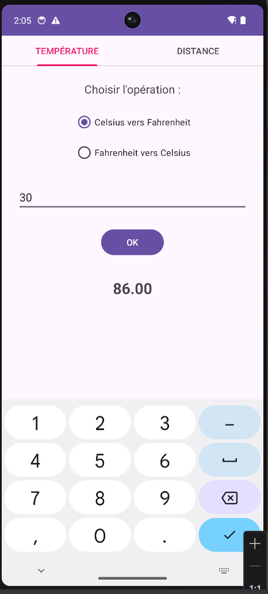
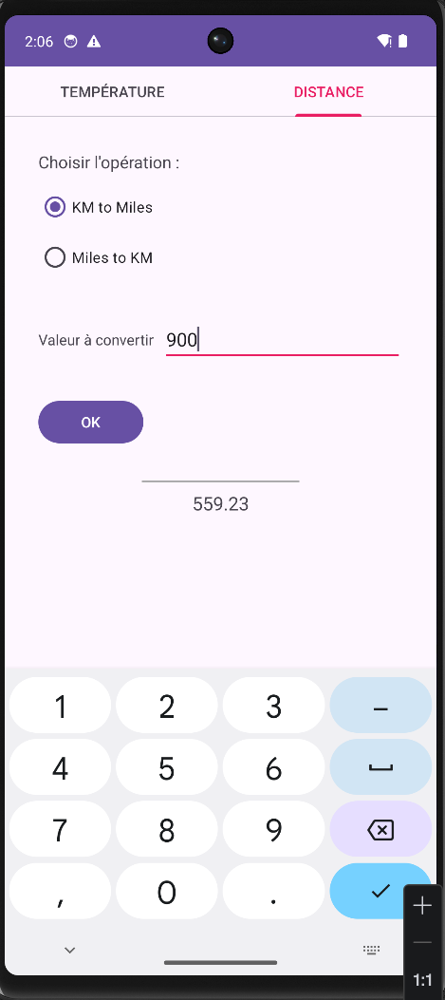

# LAB 5 - Convertisseur Multi-Onglets (Temperature & Distance)
**Cours :** Programmation Mobile : Android avec Java  

---

## Demonstration Visuelle (Tableau)
Voici le rendu final de l'application sur l'emulateur :

| Onglet 1 : Temperature | Onglet 2 : Distance |
| :---: | :---: |
|  |  |
| Conversion Celsius <-> Fahrenheit | Conversion KM <-> Miles |

---

## Demonstration Video
J'ai fait une video pour montrer la fluidite du passage entre les onglets et le fonctionnement du bouton "Quitter" avec la boite de dialogue de confirmation.

[<video src="video.mp4" controls="controls" style="max-width: 100%;">
</video>](https://github.com/user-attachments/assets/c96993d5-64a9-44e2-8eee-0e2d5a61dcfd)

---

## Les etapes detaillees de mon travail

### 1. La navigation par onglets (TabLayout + ViewPager2)
C'est la grosse nouveaute. Au lieu d'avoir une seule vue, j'ai utilise :
- **TabLayout** : Pour afficher les titres "TEMPERATURE" et "DISTANCE".
- **ViewPager2** : C'est le conteneur magique qui permet de "slider" entre les fragments.
- **TabLayoutMediator** : C'est l'outil qui fait le lien entre les deux pour que, quand on change de page, l'onglet se mette a jour tout seul.

### 2. L'Adaptateur (SectionsPagerAdapter)
Pour que le `ViewPager2` sache quel fragment afficher, j'ai du creer une classe "Adapter". C'est elle qui dit : "Si on est sur la position 0, affiche le fragment temperature, sinon affiche la distance".

### 3. Logique des Fragments
Chaque fragment est independant :
- **Temperature** : J'ai utilise des `RadioButton` pour choisir le sens de conversion. La formule est integree directement dans le clic du bouton OK.
- **Distance** : Pareil ici, mais avec le coefficient `0.621371` pour passer des Kilometres aux Miles.

### 4. Securite de fermeture (onBackPressed)
J'ai ajoute une petite touche perso : si on appuie sur le bouton "Retour" du telephone, une fenetre `AlertDialog` s'affiche pour demander si on veut vraiment quitter. Ca evite de fermer l'appli par erreur !

---

